<h1 align="center">Hi 👋, I'm Prince Saini</h1>

<h3 align="center">
  A passionate MERN Stack Developer from India
</h3>

<p align="center">
  <a href="https://linkedin.com/in/prince-saini04" target="_blank">
    
  </a>
  <a href="mailto:prince.saini0116@gmail.com">
    
  </a>
  <a href="https://prince-dev-portfolio-two.vercel.app" target="_blank">
    
  </a>
</p>

---

## 👨‍💻 About Me

- 🔭 I’m currently working on **[SaarthiX – AlumniConnect and Mentorship Platform](https://github.com/Prince-coder-ps/SaarthiX)**
- 🌱 I’m currently learning **DSA, AWS & Backend Development**
- 👯 I’m looking to collaborate on **MERN Stack & Open Source Projects**
- 🤝 I’m looking to improve my knowledge of **Scalable Backend Systems & Cloud Deployment**
- 👨‍💻 All of my projects are available at **[My Portfolio](https://prince-dev-portfolio-two.vercel.app)**
- 💬 Ask me about **React, Node.js, Express.js, MongoDB & JavaScript**
- 📫 Reach me at **[prince.saini0116@gmail.com](mailto:prince.saini0116@gmail.com)**
- 📄 Know more about my experience **[View My Resume](https://drive.google.com/file/d/1ommXNS_7yhhSaqfDPaW8-r1WLUdkFQTt/view?usp=drive_link)**
- ⚡ Fun fact: **I enjoy turning ideas into real-world web applications.**

---

## 🤝 Connect With Me

<p align="left">
  <a href="https://linkedin.com/in/prince-saini04" target="_blank">
    
  </a>
</p>

---

## 🛠️ Languages & Tools

<p align="left">
  &nbsp;&nbsp;
  &nbsp;&nbsp;
  &nbsp;&nbsp;
  &nbsp;&nbsp;
  &nbsp;&nbsp;
  &nbsp;&nbsp;
  &nbsp;&nbsp;
  &nbsp;&nbsp;
  &nbsp;&nbsp;
  &nbsp;&nbsp;
  
</p>

---

# 📊 GitHub Analytics

## 📈 Profile Overview

<picture>
  <source media="(prefers-color-scheme: dark)" srcset="./assets/overview.dark.svg">
  
</picture>

## 🔥 Contribution Streak

<picture>
  <source media="(prefers-color-scheme: dark)" srcset="./assets/contributions.dark.svg">
  
</picture>

## 📅 Contribution Activity

<picture>
  <source media="(prefers-color-scheme: dark)" srcset="./assets/lifetime.dark.svg">
  
</picture>

## 💻 Commit Activity

<picture>
  <source media="(prefers-color-scheme: dark)" srcset="./assets/cadence.dark.svg">
  
</picture>

## 🌐 Language Statistics

<picture>
  <source media="(prefers-color-scheme: dark)" srcset="./assets/languages.dark.svg">
  
</picture>

---

# 🚀 Featured Project

## SaarthiX — AlumniConnect & Mentorship Platform

> A platform designed to connect students and alumni for mentorship, networking and career guidance.

### 🧩 Tech Stack

**React.js • Node.js • Express.js • MongoDB**

### 🔗 Project

<p align="left">
  <a href="https://github.com/Prince-coder-ps/SaarthiX" target="_blank">
    
  </a>
</p>

---

# 🎯 Current Focus

```text
DSA & Problem Solving
├── Data Structures
├── Algorithms
└── LeetCode

Backend Development
├── Node.js
├── Express.js
├── REST APIs
└── Scalable Architecture

Cloud
├── AWS
└── Deployment

Full Stack Development
└── MERN Stack
